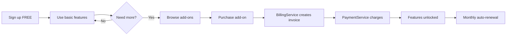

# Freemium + Add-on Implementation Guide

## 📚 Tổng quan

Hướng dẫn chi tiết cách triển khai và test **Freemium model** với **Add-on features** trong BMMS.

### Business Model Flow:
```
User đăng ký FREE → Dùng tính năng cơ bản → Mua add-on để unlock premium features
```

### Ví dụ thực tế:
- **Base plan**: Miễn phí, 10GB storage, basic features
- **Add-on 1**: Extra 100GB storage - 50,000 VND/tháng
- **Add-on 2**: AI Assistant - 100,000 VND/tháng
- **Add-on 3**: Priority Support - 30,000 VND/tháng

---

## 🏗️ Kiến trúc

### Services liên quan:

1. **SubscriptionService** (port 3012)
   - Quản lý free tier subscriptions
   - Quản lý add-on purchases
   - Emit events: `ADDON_PURCHASED`, `ADDON_RENEWED`

2. **BillingService** (port 3003)
   - Nhận event `ADDON_PURCHASED`
   - Sử dụng **FreemiumBillingStrategy**
   - Tính toán: base (0) + add-on prices + tax

3. **PaymentService** (port 3015)
   - Xử lý payment cho add-ons
   - Support recurring payment cho add-ons

---

## 🗄️ Database Schema

### Table: `addons`
```sql
CREATE TABLE addons (
  id INT PRIMARY KEY AUTO_INCREMENT,
  addon_key VARCHAR(100) UNIQUE NOT NULL,  -- 'extra_storage', 'ai_assistant'
  name VARCHAR(255) NOT NULL,
  description TEXT,
  price DECIMAL(10, 2) NOT NULL,
  billing_period ENUM('monthly', 'yearly', 'onetime') DEFAULT 'monthly',
  is_active BOOLEAN DEFAULT TRUE,
  features JSON,  -- Metadata về features
  created_at TIMESTAMP DEFAULT CURRENT_TIMESTAMP,
  updated_at TIMESTAMP DEFAULT CURRENT_TIMESTAMP ON UPDATE CURRENT_TIMESTAMP
);
```

### Table: `user_addons`
```sql
CREATE TABLE user_addons (
  id INT PRIMARY KEY AUTO_INCREMENT,
  subscription_id INT NOT NULL,
  addon_id INT NOT NULL,
  customer_id INT NOT NULL,
  price DECIMAL(10, 2) NOT NULL,  -- Price at purchase time
  status ENUM('active', 'cancelled', 'expired') DEFAULT 'active',
  purchased_at TIMESTAMP NOT NULL,
  expires_at TIMESTAMP,  -- For recurring add-ons
  next_billing_date TIMESTAMP,  -- For auto-renewal
  created_at TIMESTAMP DEFAULT CURRENT_TIMESTAMP,
  updated_at TIMESTAMP DEFAULT CURRENT_TIMESTAMP ON UPDATE CURRENT_TIMESTAMP,
  FOREIGN KEY (subscription_id) REFERENCES subscriptions(id),
  FOREIGN KEY (addon_id) REFERENCES addons(id)
);
```

---

## 🚀 Setup trong Dev Mode

### 1. Seed Add-ons Data

```sql
-- Insert sample add-ons
INSERT INTO addons (addon_key, name, description, price, billing_period, features) VALUES
('extra_storage', 'Extra 100GB Storage', 'Tăng dung lượng lưu trữ lên 110GB', 50000, 'monthly', '{"storage_gb": 100}'),
('ai_assistant', 'AI Assistant', 'Trợ lý AI thông minh, hỗ trợ 24/7', 100000, 'monthly', '{"ai_enabled": true, "requests_per_day": 1000}'),
('priority_support', 'Priority Support', 'Hỗ trợ ưu tiên qua email/chat', 30000, 'monthly', '{"priority_level": 1, "response_time": "1 hour"}'),
('custom_domain', 'Custom Domain', 'Sử dụng tên miền riêng', 20000, 'monthly', '{"custom_domain": true}');
```

### 2. Config ENV Variables

**bmms/apps/finance/billing-svc/.env**
```env
BILLING_MODE=freemium
BUSINESS_MODEL=freemium
TAX_RATE=0.1
```

**bmms/apps/order/subscription-svc/.env**
```env
SUPPORT_FREEMIUM=true
FREE_TIER_ENABLED=true
ADDON_ENABLED=true
```

### 3. Start Services

```powershell
cd bmms

# Terminal 1: BillingService
$env:BILLING_MODE="freemium"
npm run start:billing:dev

# Terminal 2: SubscriptionService
$env:SUPPORT_FREEMIUM="true"
$env:FREE_TIER_ENABLED="true"
npm run start:subscription:dev

# Terminal 3: PaymentService
npm run start:payment:dev
```

---

## 🧪 Testing Scenarios

### Scenario 1: User đăng ký Free Tier

```powershell
# POST /subscriptions/freemium
curl -X POST http://localhost:3012/subscriptions/freemium `
  -H "Content-Type: application/json" `
  -d '{
    "customerId": 1,
    "email": "user@example.com",
    "planId": 0
  }'
```

**Expected:**
- ✅ Subscription created với `is_free_tier: true`
- ✅ KHÔNG tạo invoice (totalAmount = 0)
- ✅ User có quyền truy cập basic features

### Scenario 2: List Available Add-ons

```powershell
# GET /addons
curl http://localhost:3012/addons
```

**Expected Response:**
```json
[
  {
    "id": 1,
    "addonKey": "extra_storage",
    "name": "Extra 100GB Storage",
    "description": "Tăng dung lượng lưu trữ lên 110GB",
    "price": 50000,
    "billingPeriod": "monthly",
    "isActive": true
  },
  {
    "id": 2,
    "addonKey": "ai_assistant",
    "name": "AI Assistant",
    "price": 100000,
    "billingPeriod": "monthly"
  }
]
```

### Scenario 3: User mua Add-ons

```powershell
# POST /addons/purchase
curl -X POST http://localhost:3012/addons/purchase `
  -H "Content-Type: application/json" `
  -d '{
    "subscriptionId": 1,
    "customerId": 1,
    "addonKeys": ["extra_storage", "ai_assistant"]
  }'
```

**Expected Flow:**

1. **SubscriptionService:**
   - Create `user_addons` records
   - Emit `ADDON_PURCHASED` event

2. **BillingService** (listening to `ADDON_PURCHASED`):
   - Receive event with add-on details
   - Call `createWithStrategy(dto, 'freemium', addons)`
   - **FreemiumBillingStrategy** selected
   - Calculate:
     - Base plan: 0 VND (free tier)
     - Add-on 1: 50,000 VND
     - Add-on 2: 100,000 VND
     - Subtotal: 150,000 VND
     - Tax (10%): 15,000 VND
     - **Total: 165,000 VND**
   - Create invoice with `billingMode: 'addon_only'`
   - Emit `INVOICE_CREATED` event

3. **PaymentService** (listening to `INVOICE_CREATED`):
   - Process payment for 165,000 VND
   - Emit `PAYMENT_SUCCESS` or `PAYMENT_FAILED`

**Expected Invoice:**
```json
{
  "invoiceNumber": "INV-2025-0001",
  "customerId": 1,
  "subscriptionId": 1,
  "subtotal": 150000,
  "tax": 15000,
  "totalAmount": 165000,
  "billingMode": "addon_only",
  "status": "pending",
  "metadata": {
    "businessModel": "freemium",
    "addonCharges": [
      {"addonId": "extra_storage", "amount": 50000},
      {"addonId": "ai_assistant", "amount": 100000}
    ]
  }
}
```

### Scenario 4: Check User's Active Add-ons

```powershell
# GET /addons/user/:subscriptionId
curl http://localhost:3012/addons/user/1
```

**Expected Response:**
```json
[
  {
    "id": 1,
    "subscriptionId": 1,
    "addonId": 1,
    "customerId": 1,
    "price": 50000,
    "status": "active",
    "purchasedAt": "2025-01-15T10:00:00Z",
    "nextBillingDate": "2025-02-15T10:00:00Z"
  },
  {
    "id": 2,
    "subscriptionId": 1,
    "addonId": 2,
    "customerId": 1,
    "price": 100000,
    "status": "active",
    "purchasedAt": "2025-01-15T10:00:00Z",
    "nextBillingDate": "2025-02-15T10:00:00Z"
  }
]
```

### Scenario 5: Cancel Add-on

```powershell
# DELETE /addons/user/:id
curl -X DELETE http://localhost:3012/addons/user/1
```

**Expected:**
- ✅ Update `user_addons.status = 'cancelled'`
- ✅ Emit `ADDON_CANCELLED` event
- ✅ Stop billing for this add-on

---

## 🔄 Auto-Renewal Flow

### Cron Job Setup (Monthly Renewal)

**In SubscriptionService:**
```typescript
@Cron('0 0 * * *') // Run daily at midnight
async handleAddonRenewals() {
  await this.addonService.renewRecurringAddons();
}
```

**Renewal Logic:**
1. Find all add-ons với `nextBillingDate <= NOW`
2. For each add-on:
   - Emit `ADDON_RENEWED` event
   - BillingService creates new invoice
   - PaymentService charges user
   - Update `nextBillingDate` to +1 month

---

## 📊 Business Logic Summary

### Freemium User Journey:



### Billing Modes Comparison:

| Model        | Base Price | Add-ons      | Billing Mode   | Invoice Created |
|--------------|------------|--------------|----------------|-----------------|
| Retail       | $50        | N/A          | `onetime`      | On order        |
| Subscription | $99/month  | N/A          | `recurring`    | Monthly         |
| Freemium     | FREE       | $50 + $100   | `addon_only`   | On add-on buy   |

---

## 🐛 Troubleshooting

### Issue 1: Add-on purchase không tạo invoice

**Check:**
1. Verify `ADDON_PURCHASED` event được emit
2. Check BillingService có listen event này không
3. Verify `BILLING_MODE=freemium` trong ENV

**Debug:**
```powershell
# Check Kafka events
npm run kafka:console-consumer -- --topic addon.purchased
```

### Issue 2: Strategy không được chọn đúng

**Check logs:**
```
✅ Selected strategy: FreemiumBillingStrategy (from metadata)
```

**Fix:**
- Ensure `businessModel: 'freemium'` trong metadata
- Set `BILLING_MODE=freemium` trong ENV

### Issue 3: Tax calculation sai

**Check:**
```env
TAX_RATE=0.1  # Must be decimal, not percentage
```

---

## 🎯 Integration với LLM

### User Input:
```
"Tạo gói Freemium miễn phí với 3 add-on: Extra Storage 50k/tháng, AI Assistant 100k/tháng, Priority Support 30k/tháng"
```

### LLM Output:
```json
{
  "changeset": {
    "model": "FreemiumWithAddons",
    "features": [
      {"key": "business_model", "value": "freemium"},
      {"key": "base_plan_price", "value": 0},
      {"key": "addons_enabled", "value": true},
      {"key": "addon_extra_storage_price", "value": 50000},
      {"key": "addon_ai_assistant_price", "value": 100000},
      {"key": "addon_priority_support_price", "value": 30000}
    ],
    "impacted_services": ["SubscriptionService", "BillingService", "PaymentService"]
  },
  "metadata": {
    "intent": "business_model_change",
    "to_model": "freemium_addon"
  }
}
```

### K8s Deployment:
```yaml
# SubscriptionService deployment với freemium config
env:
  - name: SUPPORT_FREEMIUM
    value: "true"
  - name: ADDON_ENABLED
    value: "true"

# BillingService deployment
env:
  - name: BILLING_MODE
    value: "freemium"
```

---

## 📚 Related Docs

- `DEV_MODE_CONFIG_GUIDE.md` - Cách config ENV cho dev mode
- `BILLING_STRATEGY_PATTERN.md` - Strategy pattern architecture
- `EVENT_DRIVEN_ARCHITECTURE.md` - Event flow giữa services

---

## ✅ Checklist

- [x] Tạo `addons` và `user_addons` tables
- [x] Implement AddonService
- [x] Implement FreemiumBillingStrategy
- [x] Add `ADDON_PURCHASED`, `ADDON_RENEWED` events
- [x] BillingService listen add-on events
- [x] Test freemium signup (no invoice)
- [x] Test add-on purchase (invoice created)
- [x] Test add-on renewal (monthly)
- [x] Update LLM prompt với freemium examples

---

## 🚀 Production Deployment

```bash
# 1. Build Docker images
docker build -t your-registry/subscription-svc:freemium .
docker build -t your-registry/billing-svc:freemium .

# 2. Apply K8s manifests
kubectl apply -f k8s/subscription-svc-freemium.yaml
kubectl apply -f k8s/billing-svc-freemium.yaml

# 3. Verify
kubectl get pods -n order
kubectl logs -f subscription-svc-xxx -n order
```
